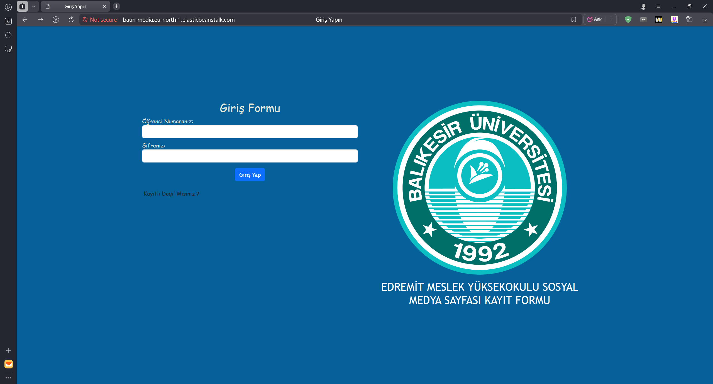
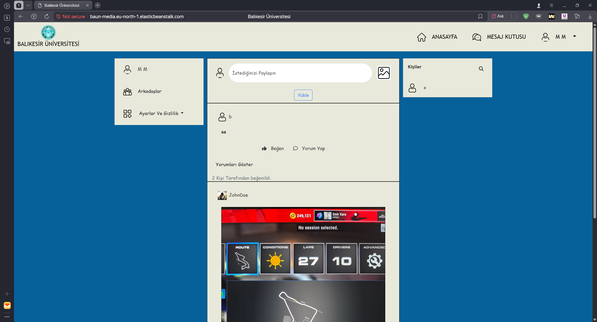
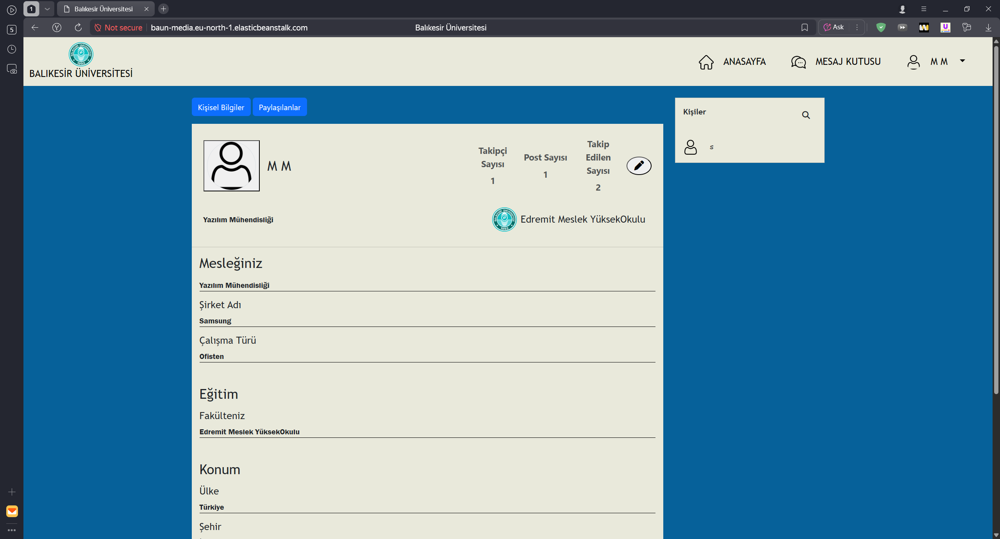
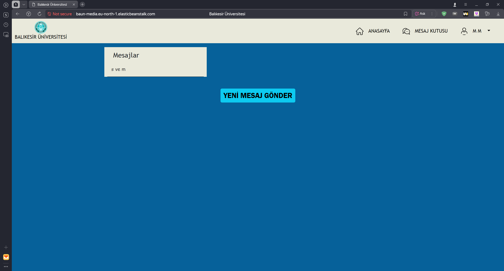

# BAUN Media

[Türkçe](#türkçe) | [English](#english)

🔗 **Canlı Demo / Live Demo:** http://baun-media.eu-north-1.elasticbeanstalk.com/

---

## Türkçe

Balıkesir Üniversitesi Bilgisayar Programcılığı ve benzer alanlardan mezun olanların birbiriyle iletişim kurabilmesi ve yardımlaşabilmesi için geliştirilmiş bir sosyal medya projesidir.

### Özellikler

- Kullanıcı kaydı ve girişi
- Kullanıcı arama ve takip etme
- Gönderi paylaşma, düzenleme ve silme
- Gönderi beğenme
- Gönderilere yorum yapma, yorum düzenleme ve silme
- Kullanıcılar arası mesajlaşma
- Profil sayfası ve kullanıcı bilgilerini düzenleme

### Kullanılan Teknolojiler

- HTML, CSS, JavaScript
- Bootstrap
- Python, Django
- MySQL (AWS RDS)

### Ortam Değişkenleri

Projeyi çalıştırmak için gereken değişkenler `.env.example` dosyasında listelenmiştir.

### İletişim

Meriç Kaya – [LinkedIn](https://www.linkedin.com/in/meri%C3%A7-kaya-883b08269/) – merickay0@yandex.com

---

## English

A social media project built to help graduates of Computer Programming and related programs at Balıkesir University connect with and support each other.

### Features

- User registration and login
- Searching and following users
- Creating, editing and deleting posts
- Liking posts
- Commenting on posts, editing and deleting comments
- Direct messaging between users
- Editing profile page and account information

### Tech Stack

- HTML, CSS, JavaScript
- Bootstrap
- Python, Django
- MySQL (AWS RDS)

### Environment Variables

The variables required to run the project are listed in the `.env.example` file.

### Contact

Meriç Kaya – [LinkedIn](https://www.linkedin.com/in/meri%C3%A7-kaya-883b08269/) – merickay0@yandex.com
